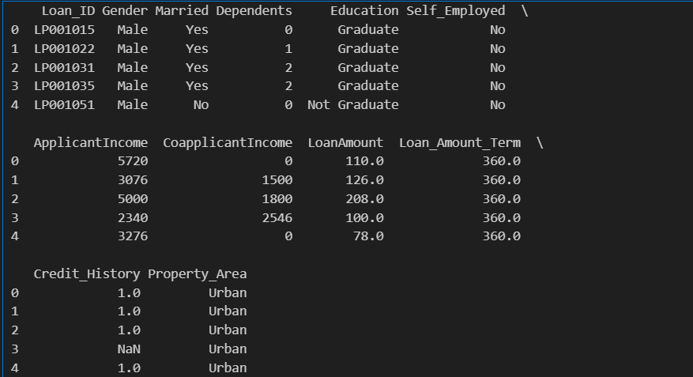
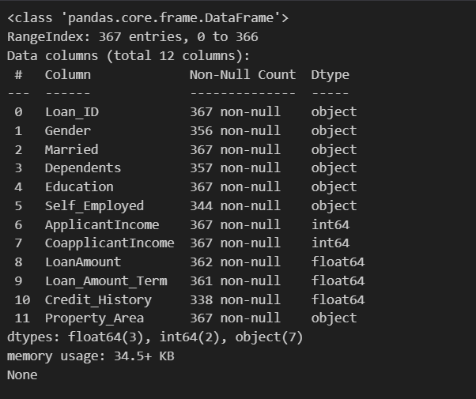
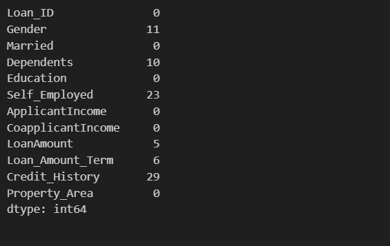
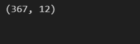
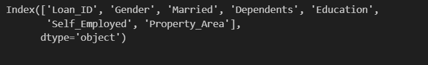
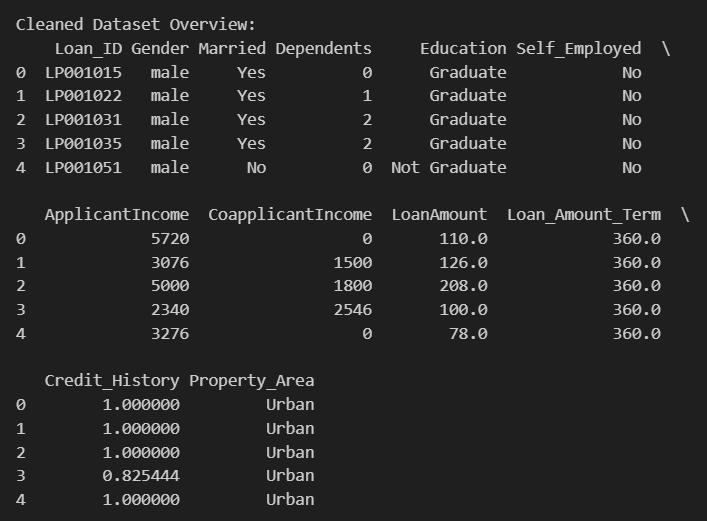
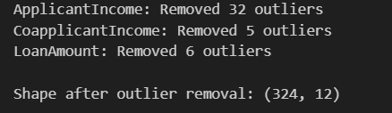
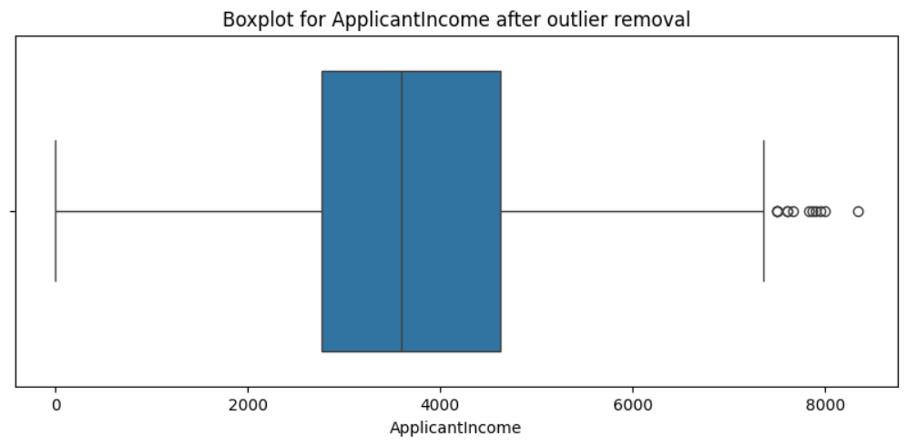
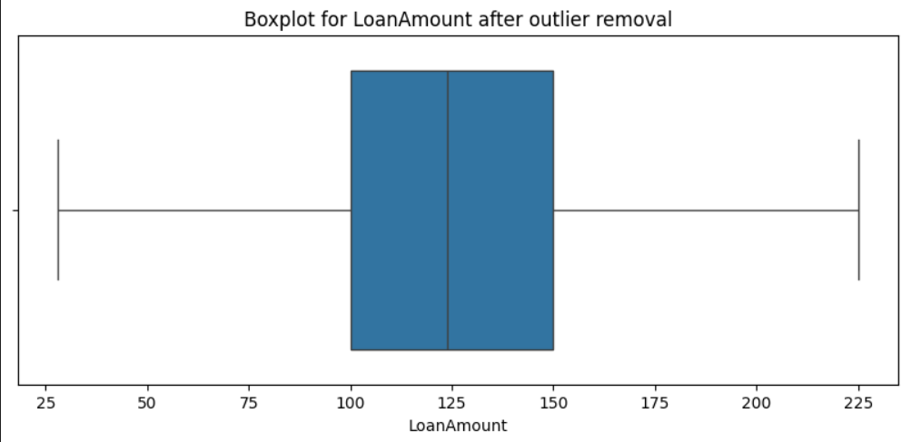

# Exno:1
Data Cleaning Process

# AIM
To read the given data and perform data cleaning and save the cleaned data to a file.

# Explanation
Data cleaning is the process of preparing data for analysis by removing or modifying data that is incorrect ,incompleted , irrelevant , duplicated or improperly formatted. Data cleaning is not simply about erasing data ,but rather finding a way to maximize datasets accuracy without necessarily deleting the information.

# Algorithm
STEP 1: Read the given Data

STEP 2: Get the information about the data

STEP 3: Remove the null values from the data

STEP 4: Save the Clean data to the file

STEP 5: Remove outliers using IQR

STEP 6: Use zscore of to remove outliers

# Coding and Output
```
import pandas as pd
import numpy as np
import matplotlib.pyplot as plt
import seaborn as sns
from scipy import stats
df = pd.read_csv(r"E:\Loan_data.csv")
print(df.head())
```

```
print(df.info())
```

```
print(df.isnull().sum())
```


```
df.drop_duplicates(inplace=True)
print(df.shape)
```

```
numeric_cols = df.select_dtypes(include=['object']).columns
print(numeric_cols)
```

```
if 'Gender' in df.columns:
    df['Gender'] = df['Gender'].str.strip().str.lower()

print("\nCleaned Dataset Overview:")
print(df.head())
```

```
def remove_outliers_iqr(dataframe, column):
    Q1 = dataframe[column].quantile(0.25)
    Q3 = dataframe[column].quantile(0.75)
    IQR = Q3 - Q1
    lower_limit = Q1 - 1.5 * IQR
    upper_limit = Q3 + 1.5 * IQR
    before = dataframe.shape[0]
    dataframe = dataframe[(dataframe[column] >= lower_limit) & (dataframe[column] <= upper_limit)]
    after = dataframe.shape[0]

    print(f"{column}: Removed {before - after} outliers")
    return dataframe
numeric_columns = ['ApplicantIncome', 'CoapplicantIncome', 'LoanAmount']
for col in numeric_columns:
    if col in df.columns:
        df = remove_outliers_iqr(df, col)
print(df.shape)
```

```
for col in ['ApplicantIncome', 'LoanAmount']:
    if col in df.columns:
        plt.figure(figsize=(10, 4))
        sns.boxplot(x=df[col])
        plt.title(f"Boxplot for {col} after outlier removal")
        plt.show()
```


# Result
Succesfully performed data cleaning process and found out the outlier